# 📌 Django Blog Project

 ## ✅ Overview
A blog platform built with Django, featuring user authentication, category subscriptions with email notifications, post interactions (like, dislike, comments), and an admin panel for full CRUD operations.

## 🔹 How To Run 

## 🚀 Main Features

### 🔹 Landing Page

### - Header
  - Login/Register links (or Logout if authenticated).
  - Admins see an additional "Manage Blog" link.

 ### - Sidebar (Categories)
  - Lists all categories with Subscribe/Unsubscribe buttons.
  - Redirects to posts filtered by category.
  - Email confirmation upon subscription.

### - Body (Top Posts)
  - Displays top posts sorted by publish date.
  - Clicking a post image redirects to its page.

### - Footer (Pagination)
  - Displays 5 posts per page with Next/Previous buttons.

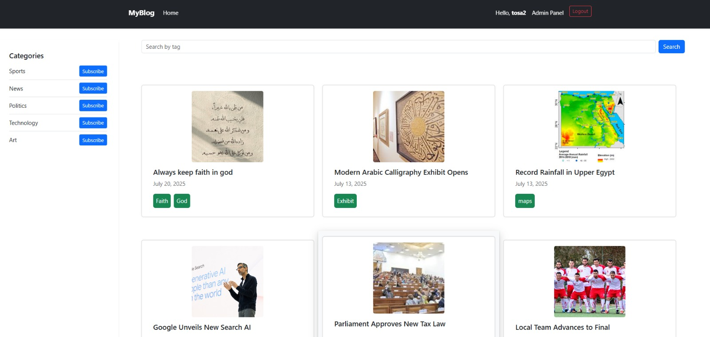

### 🔹 Authentication Pages

- **Registration Page**
  - Unique username & email validation.
  - Password confirmation.

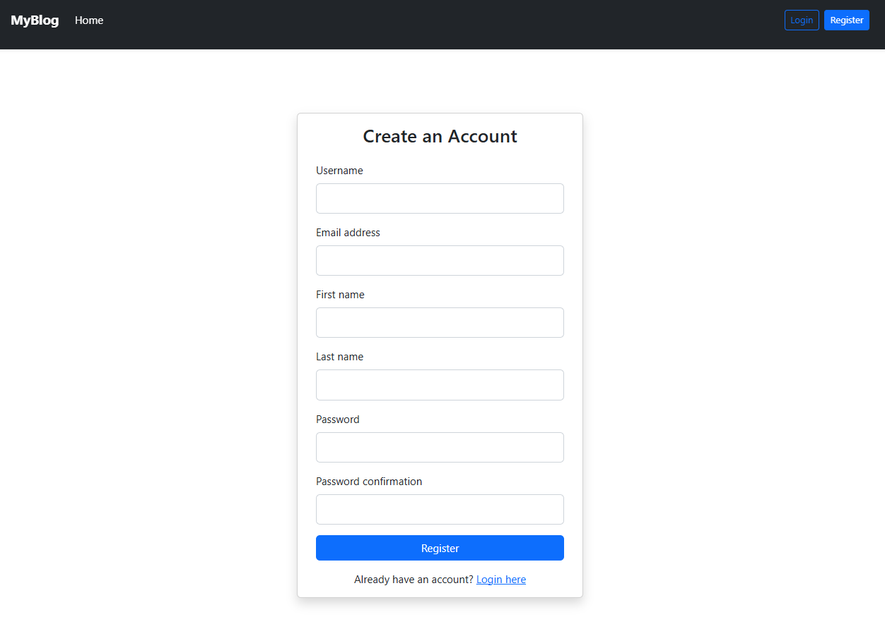

- **Login Page**
  - Authenticates users.
  - Shows error message if account is blocked.

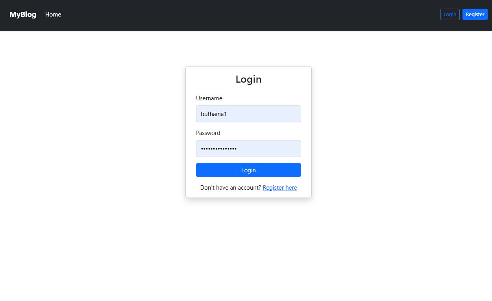

### 🔹 Post Page

 - Content: Title, Image, Content, Category, Tags, Comments.

   
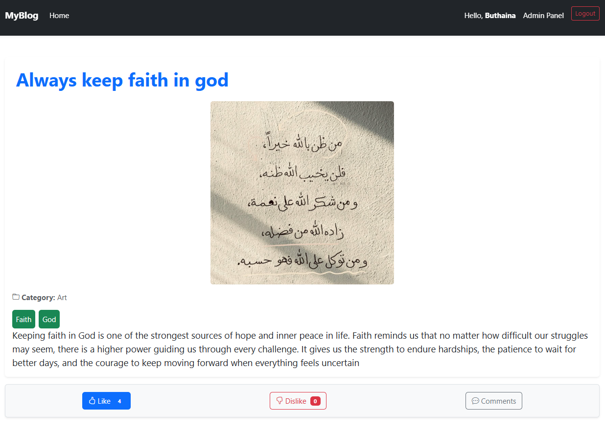

### - Interactions:

  - Add comments & replies (signed-in users only).
  - Inappropriate words censored automatically (stupid → ******).
  - Like/Dislike counter .

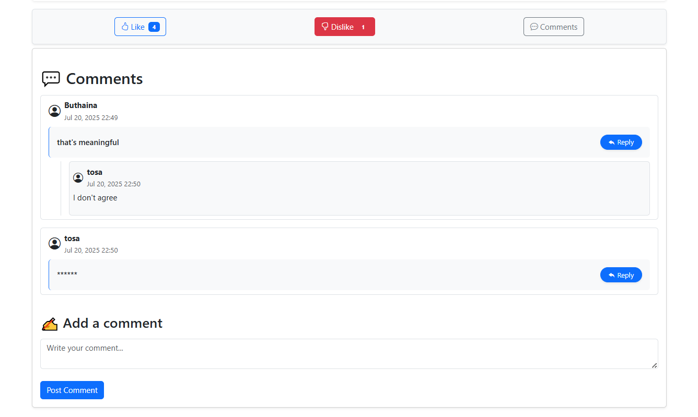

### 🔹 Normal User Features

  - Doesn't have access over the admin panel
  - View posts & categories.

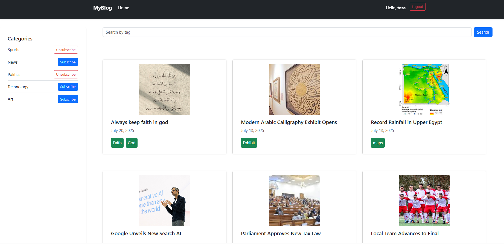

 - Search by tag or title.

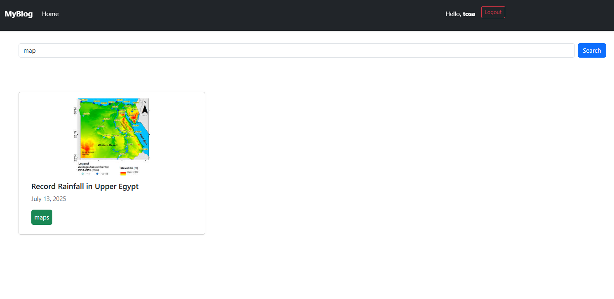

  - Like, dislike, comment, and reply (if logged in).

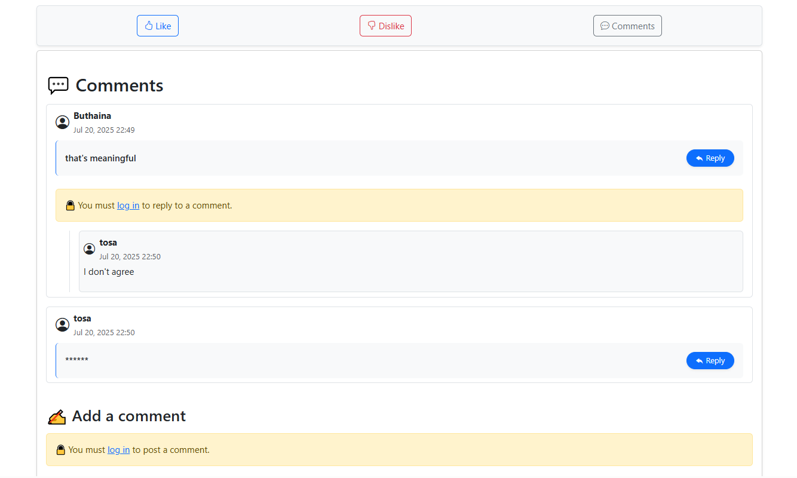
    

### 🔹 Admin Panel Features

  - CRUD Operations: Posts, Categories, Forbidden Words, Users.
  - User Management: Block/unblock users, promote users to admin.
  - UI: Based on AdminLTE template.

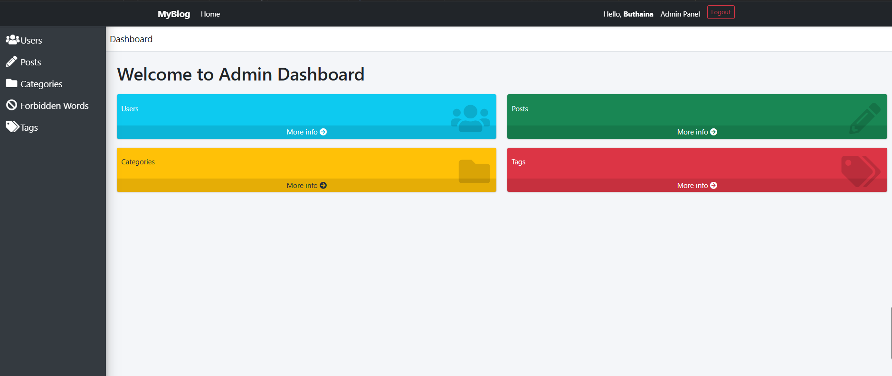

### - Admin Can perform all CRUD operations on posts
  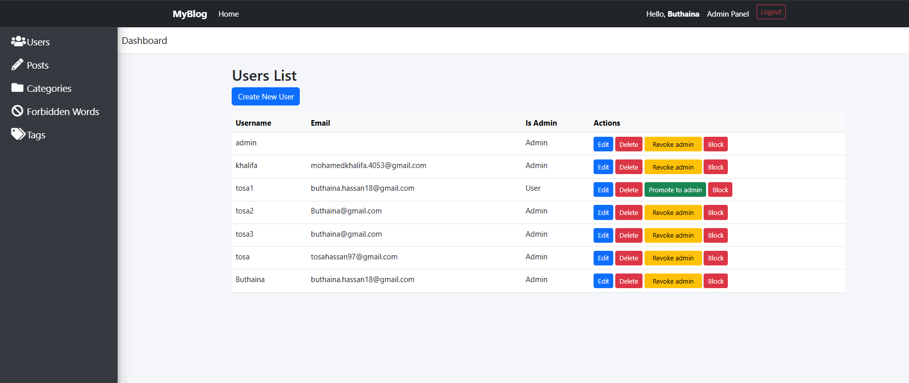
  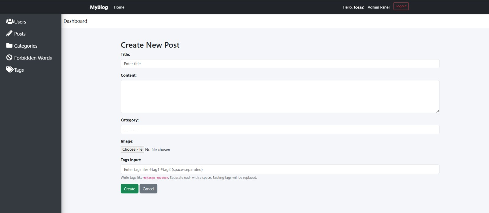
### -  Admin Can perform all CRUD operations on categories
  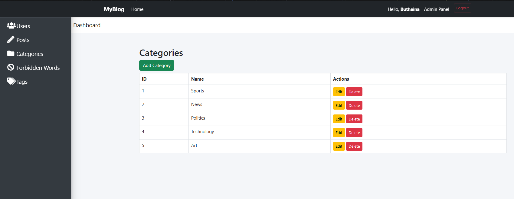
### -  Admin Can perform all CRUD operations on forbidden words
   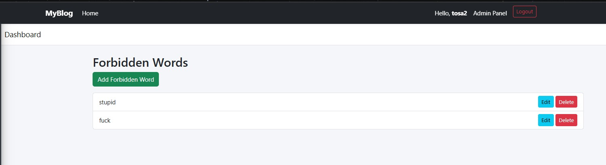
   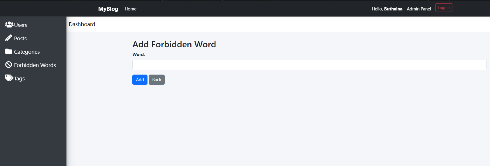
### -  Admin Can perform all CRUD operations on users.
   
 

